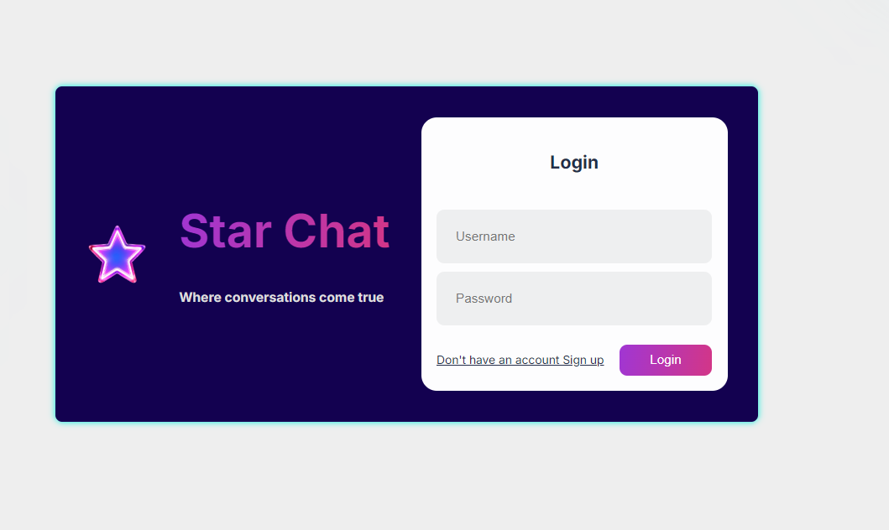

<<<<<<< HEAD
# Real-Time-Chat
<h1>MERN Chat App</h1>

A real-time chat application built using the MERN stack (MongoDB, Express.js, React.js, Node.js) and Socket.io for real-time communication.
=======
<h1>⭐# Real-Time-Chat⭐</h1>

A real-time chat application built using the MERN stack (MongoDB, Express.js, React.js, Node.js) and Socket.io for real-time communication.

>>>>>>> a1790b62109a6490d62b8e3368aa9fd2438ca30a

<h3>Features</h3>
🔐 User Authentication: Secure login and registration using JWT.
💬 Real-Time Messaging: Instant messaging with real-time updates using Socket.io.
👥 User Management: View online users and manage user profiles.
📂 File Uploads: Share images and files within the chat.
📜 Chat History: Persistent chat history stored in MongoDB.
🌐 Responsive Design: Fully responsive design for desktop and mobile.

<h3>Tech Stack</h3>
<h4>Frontend:</h4>
React.js
Redux
CSS3 / SCSS
<h4>Backend</h4>
Node.js
Express.js
MongoDB
Socket.io
Others:
JWT for authentication
Nodemon for development
Multer for file uploads
Installation
Clone the repository:

bash
Copy code
git clone https://github.com/Rukundo-Bahati/star-chat-app.git
cd star-chat-app
Install server dependencies:

bash
Copy code
cd server
npm install
Install client dependencies:

bash
Copy code
cd ../client
npm install
Set up environment variables:

Create a .env file in the server directory and add your MongoDB URI and JWT secret:
makefile
Copy code
MONGO_URI=your_mongodb_uri
JWT_SECRET=your_jwt_secret
Run the server:

bash
 
Copy code
 
cd ../client
 
npm start
 
Usage
Open your browser and go to http://localhost:3000.
 
Register a new account or log in with an existing account.
 
Start chatting with online users!

Features
Real-Time Messaging: Send and receive messages instantly using WebSockets.
 
User Authentication: Secure user registration and login with JWT (JSON Web Tokens).
 

Chat Rooms: Create and join chat rooms to converse with multiple participants.
 
Private Messaging: Send direct messages to individual users.
 
Message History: Persistent message history stored in MongoDB.
 
Responsive Design: Fully responsive UI for an optimal experience on both desktop and mobile devices.
 
<h2>Technologies Used</h2>
<h3>Frontend:</h3>

React.js: For building the user interface.
Redux: State management for React.
CSS Modules: Scoped and maintainable styles.

<h3>Backend:</h3>

Node.js: Server-side runtime environment.
 
Express.js: Web framework for Node.js.
 
WebSocket: Real-time communication.
 
MongoDB: NoSQL database for storing user data and messages.
 
Mongoose: ODM (Object Data Modeling) library for MongoDB.
 
JWT: Secure authentication mechanism.

<h3>Environment variables</h3>
Copy code
MONGODB_URI=your_mongodb_uri
 
JWT_SECRET=your_jwt_secret
 
PORT=5000
 

<h3>Acknowledgements</h3>
Socket.IO for real-time communication.
 
JWT for secure authentication.
 
React for the powerful UI library.
 
Express.js for the robust backend framework.
 
MongoDB for the scalable database solution.
 
Contact
If you have any questions, suggestions, or feedback, feel free to reach out at rukundorca@gmail.com.

<h4>Thank you for using Real-Time Chat! We hope you enjoy using it as much as we enjoyed building it🎇🎇🎇🎇.</h4>

Email: rukundorca@gmail.com
LinkedIn: https://www.linkedin.com/in/bahati-samuel-293578302/
GitHub: https://github.com/Rukundo-Bahati
